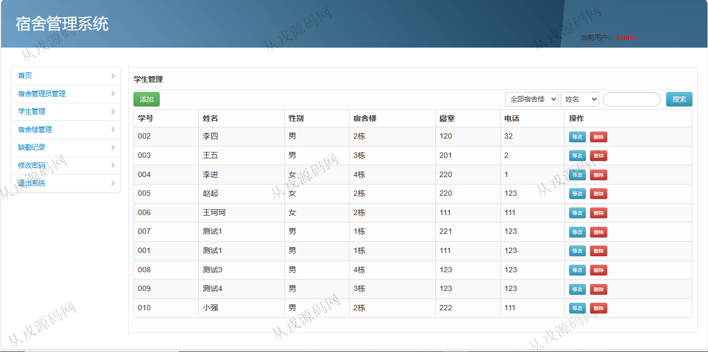
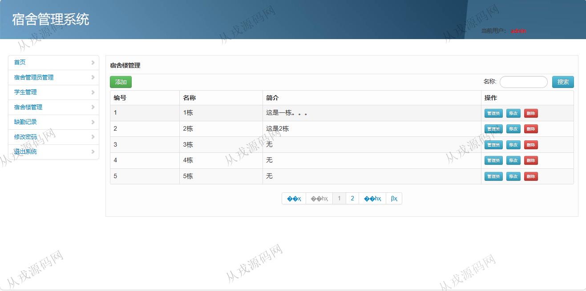
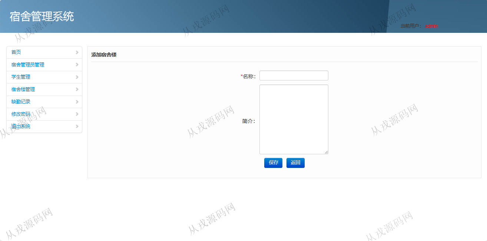
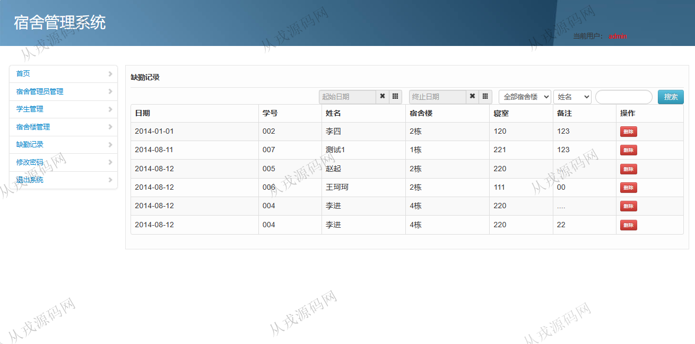
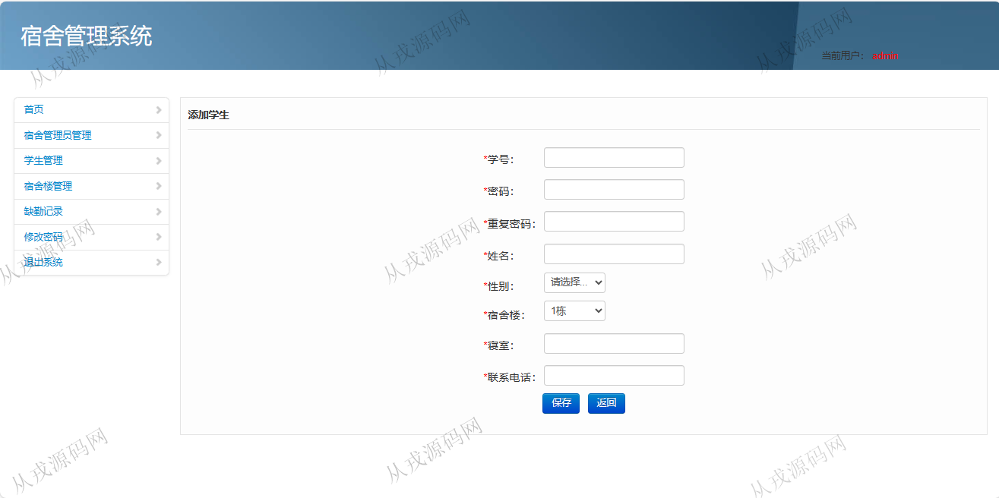
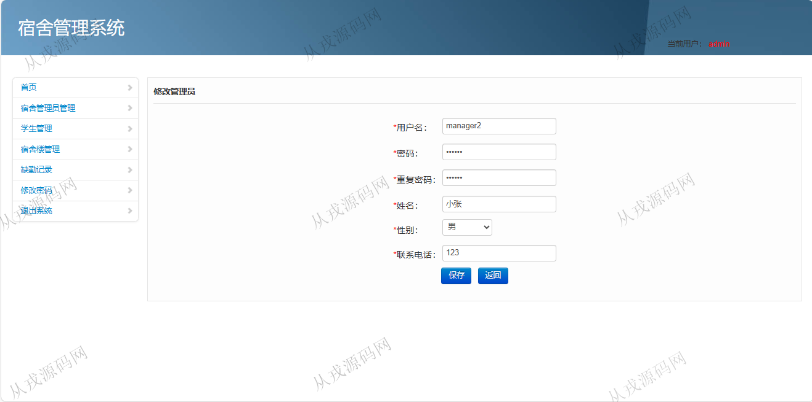
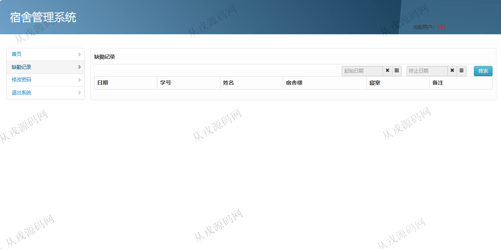
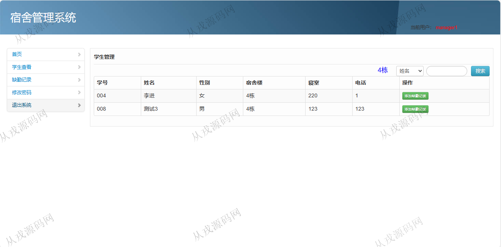

<h1 align="center">201.学生宿舍管理系统</h1>

- <b>完整代码获取地址：从戎源码网 ([https://armycodes.com/](https://armycodes.com/))</b>
- <b>技术探讨、资料分享，请加QQ群：692619798</b> 
- <b>作者微信：19941326836  QQ：952045282</b> 
- <b>承接计算机毕业设计、Java毕业设计、Python毕业设计、深度学习、机器学习</b>
- <b>选题+开题报告+任务书+程序定制+安装调试+论文+答辩ppt 一条龙服务</b>
- <b>所有选题地址 ([https://github.com/YuLin-Coder/AllProjectCatalog](https://github.com/YuLin-Coder/AllProjectCatalog)) </b>

## 项目介绍
基于java+jsp的学生宿舍管理系统：前端 jsp、jquery，后端 servlet、jdbc；角色分为管理员、学生、宿舍管理员；集成宿舍楼管理、学生管理、缺勤记录等功能于一体的系统。

## 功能介绍

- 基本功能：登录，退出系统，密码修改
- 管理员管理：管理员信息的增删改查，按姓名、用户名模糊搜索
- 学生管理：学生信息的增删改查，按姓名模糊搜索
- 宿舍楼管理：宿舍楼信息的增删改查，按名称模糊搜索
- 缺勤记录：缺勤记录列表查询，按姓名模糊搜索，记录删除操作

## 环境

- <b>IntelliJ IDEA 2021.3</b>

- <b>Mysql 5.7.26</b>

- <b>Tomcat 7.0.73</b>

- <b>JDK 1.8</b>

## 运行截图

